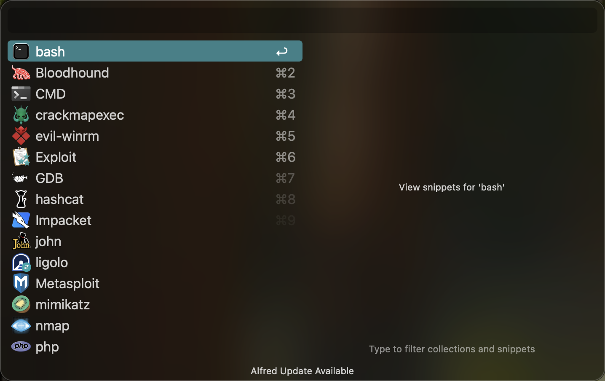

# Useful Alfred Snippets for Pentest

English | [中文](README_zh.md)

## Introduction

In Alfred, the Snippets feature can be used to manage commonly used command-line codes, allowing quick copy-paste usage via a hotkey and supporting keyword search. This project shares some of the code snippets I personally use to improve efficiency during penetration testing. 

You can check out more detailed introductions and other productivity tools on [my blog](https://www.ju1y.top/blogs/3).

## Usage

- Download [Alfred](https://www.alfredapp.com/)

- Download this project: `git clone https://github.com/JackJuly/useful-alfred-snippets`

- Double-click each file to import and install directly

- After setting up hotkeys, you can quickly bring up and use the snippets

 **Special Note:** In Alfred's Snippets settings, "Keyword" has a specific function. In my setup, however, "Keyword" is used only as a categorization keyword without utilizing its full functionality.

**Customization:** You can add new snippets as needed. Add **_keywords_, _purposes_**, etc., to the name for easy searching.

