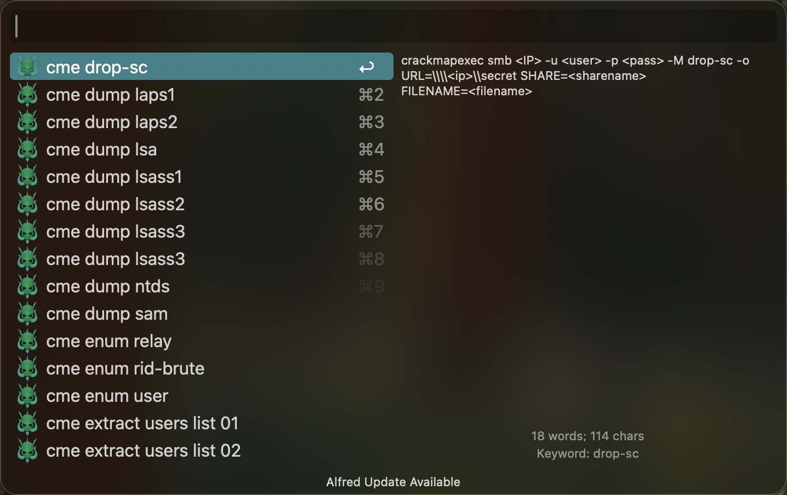
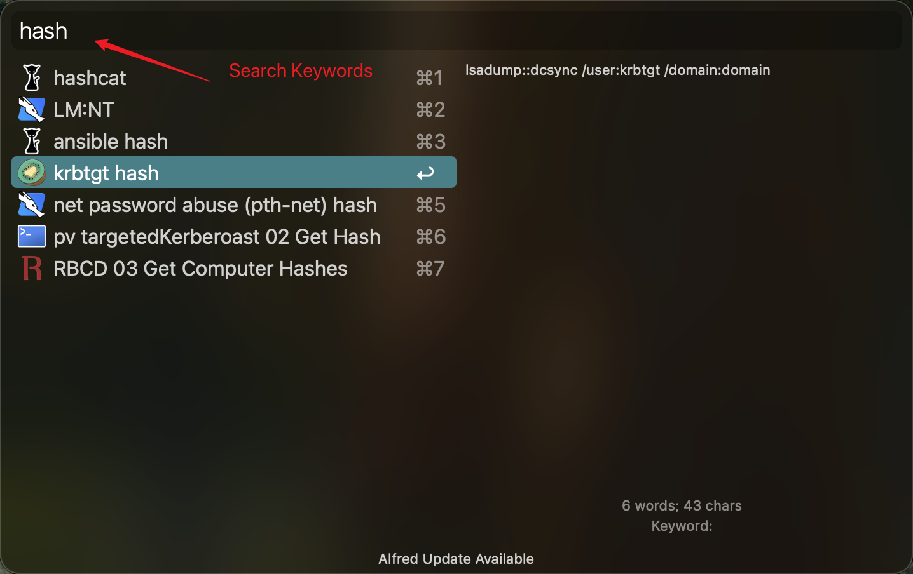
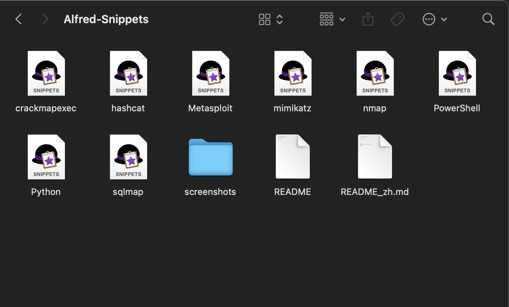
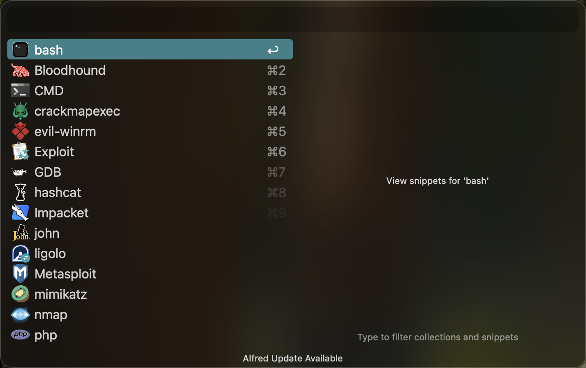
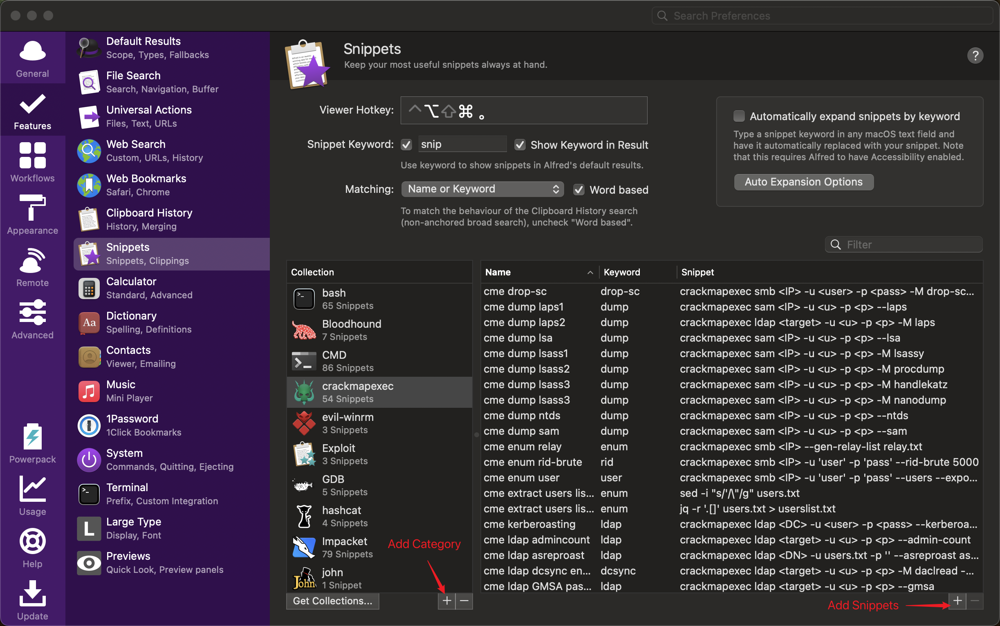

# Useful Alfred Snippets for Pentest

[English](README.md) | 中文

## 介绍

在Alfred中，可使用Snippets功能管理常用的命令行代码，快捷键呼出快速复制粘贴使用，并支持关键词搜索。本项目分享了我个人使用的一些代码片段，在渗透测试时可以提高效率。

可以在[我的博客](https://www.ju1y.top/blogs/3)中查看一些详细的介绍及其他效率工具的分享。

## 使用方法

- 下载[Alfred](https://www.alfredapp.com/)

- 下载本项目：`git clone https://github.com/JackJuly/useful-alfred-snippets`

- 双击每个文件即可直接导入安装

- 设置好快捷键后即可快速呼出使用

  **特别提示**：在Alfred的Snippets设置中，“Keyword”有特定的功能。而我的设置中并没有发挥“Keyword”的功能，仅将其当作分类的关键词。

**自定义**：可自己根据需要添加新的Snippets。在设置名称时加上**_关键词_，_用途_**等，以方便快速搜索。

